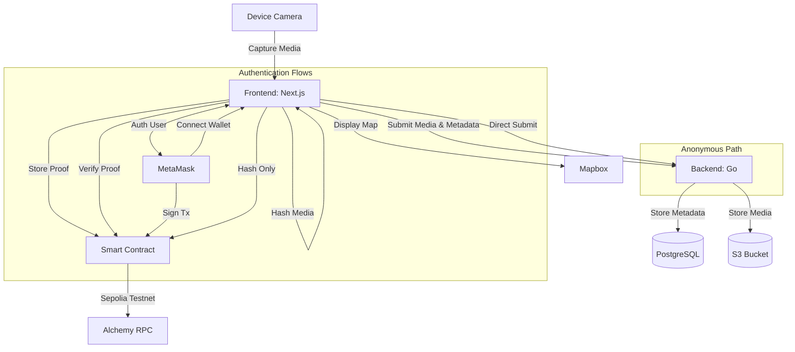

## System Architecture

The following Mermaid diagram illustrates the flow of data and responsibilities between the various components of the system.

### Notes:
- **Frontend (Next.js)**: Captures media directly from camera, hashes data, and interacts with blockchain and visualization tools.
- **MetaMask**: Provides authentication through wallet connection and transaction signing.
- **Camera Integration**: Media can only be captured directly from the device camera, not uploaded from gallery.
- **Authentication**: Wallet-based with MetaMask, no traditional JWT necessary.
- **Anonymous Mode**: Users can submit content without connecting a wallet, with limited functionality.
- **Backend (Go)**: Receives media and metadata, manages storage, and performs coordination logic.
- **PostgreSQL**: Stores structured metadata for efficient querying.
- **S3 Bucket**: Used to store large media files such as images or videos.
- **Smart Contract**: Verifies and stores cryptographic proof on-chain.
- **Alchemy RPC**: Facilitates communication with the Sepolia Ethereum testnet.
- **Mapbox**: Provides an interactive UI for visualizing submitted and verified evidence.