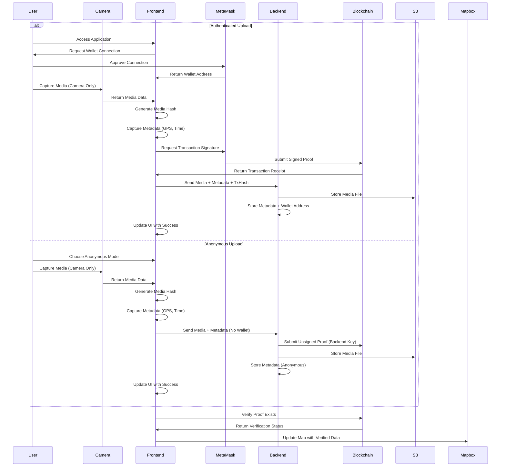

## Authentication and Data Flow

The following sequence diagram illustrates the data flow for authentication and verification process in the dApp, showing both authenticated and anonymous paths.

### Notes:
- **Authentication**: Handled through MetaMask wallet connection - no JWT required
- **Session Persistence**: MetaMask connection remains active until disconnected
- **Camera Restriction**: Media can only be captured directly from device camera
- **Anonymous Mode**: Users can submit without connecting a wallet
- **Verification**: All content is verified on-chain regardless of authentication status
- **Wallet as Identity**: The connected wallet address serves as the user identifier